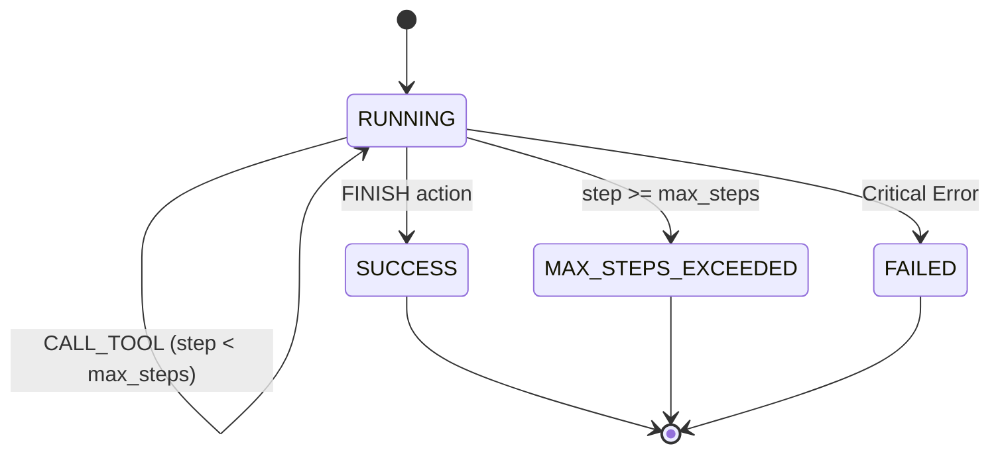

# Technical Architecture & Design Specification

This document details the software architecture, evaluation design, AST verification rules, reward calculation formulation, and trajectory state machine of the `AI_reward_harness` framework.

---

## 1. System Overview

The framework provides an end-to-end evaluation harness for candidate code generated by AI models and autonomous coding agents. It serves two primary functions:
1. **RL Reward Engine**: Computes dense, shaped scalar reward signals $R \in [-1.0, 1.0]$ to train reinforcement learning models (e.g. via PPO, DPO, or GRPO).
2. **Agent Trajectory Simulator**: Manages multi-turn environment step execution, tool dispatching, timeout isolation, and trajectory state tracking.

```mermaid
flowchart TD
    subgraph Candidate Submission
        Code[Generated Python Code]
    end

    subgraph Tier 1: Static AST Verification
        AST[ast.parse] --> Whitelist[Import Whitelist Checker]
        Whitelist --> Signatures[Function Signature & Presence Validator]
        Signatures --> BlockedBuiltins[Blocked Built-in Call Checker]
    end

    subgraph Tier 2: Dynamic Execution Engine
        Subprocess[Subprocess Isolation] --> Assertions[Unit Test Assertions]
    end

    subgraph Reward Engine
        Calculator[Reward Calculation Logic] --> Result[EvalResult & Reward R]
    end

    Code --> Tier 1
    Tier 1 -->|Pass| Tier 2
    Tier 1 -->|Violation| Calculator
    Tier 2 --> Calculator
```

---

## 2. Static AST Verification Engine (`ast_drill.py`)

Static analysis is performed using Python's built-in `ast` module before any candidate code is executed dynamically.

### 2.1 Security & Import Whitelist Rules
- **Import Inspection (`visit_Import`)**: Top-level imports (e.g. `import os`, `import sys`) are matched against `allowed_imports`. Any import outside the whitelist generates a policy violation.
- **From-Import Inspection (`visit_ImportFrom`)**: Module from-imports (e.g. `from subprocess import Popen`) check `node.module`. If unapproved, a policy violation is recorded.
- **Dangerous Built-in Call Interception (`visit_Call`)**: Explicit call invocations to `eval()`, `exec()`, and `__import__()` are intercepted and blocked.
- **Default Allowed Modules**: `math`, `typing`, `collections`, `itertools`, `dataclasses`.

### 2.2 Function Presence & Contract Validation
- **Target Function Check (`visit_FunctionDef`)**: Verifies that the required function (e.g. `clamp`, `compute_dot_product`) is defined in the AST.
- **Signature Parameter Count**: Counts positional parameters (`len(node.args.args)`) and verifies exact parameter counts against expected contract specifications.

---

## 3. Dynamic Execution & Subprocess Isolation (`main.py` & `reward_harness.py`)

Candidate code execution is strictly decoupled from the evaluator process to prevent host environment corruption or resource exhaustion.

### 3.1 Subprocess Sandboxing
- Code execution is spawned via `subprocess.run([sys.executable, "-"], input=code, capture_output=True, text=True, timeout=timeout_sec)`.
- Standard input (`stdin`) passes code and assertion strings cleanly.
- `timeout_sec` (default: 4s or 5s) handles infinite loops or non-terminating code, returning `TimeoutExpired` feedback without crashing the harness.

### 3.2 Assertion Execution Pipeline
- Each unit test assertion (e.g. `clamp(5, 0, 10) == 5`) is appended as `assert <test_expr>` to the candidate code string.
- Each test expression is evaluated independently in isolated subprocess runs.

---

## 4. Mathematical Reward Formulation

The scalar reward $R$ is shaped to guide RL models from syntax correctness to functional correctness:

$$R = \begin{cases} 
-1.0 & \text{if AST validation or syntax check fails} \\
0.0 & \text{if runtime error occurs or } 0 \text{ unit tests pass} \\
0.5 \times \frac{k}{N} & \text{if } 0 < k < N \text{ unit tests pass (partial credit)} \\
1.0 - \max(0, (\text{step} - 1) \times 0.05) & \text{if all } N \text{ unit tests pass (full pass)}
\end{cases}$$

Where:
- $k$: Number of unit test assertions passed.
- $N$: Total number of unit test assertions ($N > 0$).
- $\text{step}$: 1-indexed turn counter for multi-turn optimization.

---

## 5. Agent Trajectory State Machine (`main.py`)

The multi-turn agent interaction follows a formal discrete state machine:



### Data Schemas
- **`AgentStatus`**: Enum (`RUNNING`, `SUCCESS`, `FAILED`, `MAX_STEPS_EXCEEDED`).
- **`TrajectoryStep`**: Captures `step_idx`, `action`, `tool_name`, `tool_input`, `tool_output`, and `is_terminal`.
- **`AgentState`**: Holds `task_goal`, `max_steps`, `current_step`, `status`, and complete history trajectory trace `list[TrajectoryStep]`.

---

## 6. Project Directory Structure

```text
AI_reward_harness/
├── reward_harness.py   # Tiered evaluation pipeline & scalar reward engine
├── ast_drill.py        # Static AST policy verifier & contract checker
├── main.py             # Agent environment step function & tool dispatcher
├── tests/              # Automated unit test suite (pytest)
│   ├── test_reward_harness.py
│   ├── test_ast_drill.py
│   └── test_main.py
├── pyproject.toml      # Project metadata & dependencies
├── README.md           # User guide & usage documentation
├── ARCHITECTURE.md     # Technical specification & architecture design
└── LICENSE             # MIT License
```
