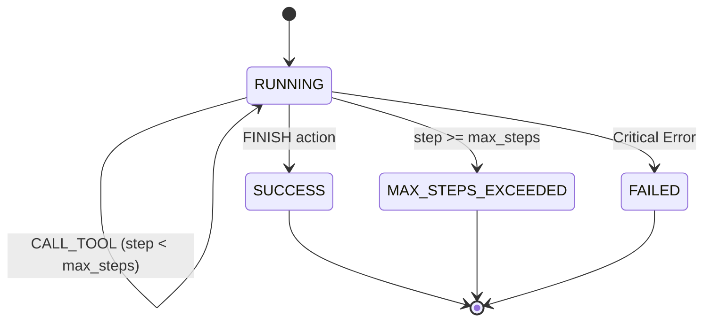

# Technical Architecture & Design Specification

This document details the software architecture, evaluation design, AST verification rules, reward calculation formulation, metrics computation, and trajectory state machine of the `AI_reward_harness` framework.

---

## 1. System Overview

The framework provides an end-to-end evaluation harness for candidate code generated by AI models and autonomous coding agents. It serves two primary functions:
1. **RL Reward & Metrics Engine**: Computes dense, shaped scalar reward signals $R \in [-1.0, 1.0]$ and rich static/dynamic execution metrics (`pass_rate`, `exec_time_ms`, `complexity`, `loc`).
2. **Agent Trajectory Simulator**: Manages multi-turn environment step execution, tool dispatching, timeout isolation, and trajectory state tracking.

```mermaid
flowchart TD
    subgraph Candidate Submission
        Code[Generated Python Code]
    end

    subgraph Tier 1: Static AST Verification & Complexity
        AST[ast.parse] --> Whitelist[Import Whitelist Checker]
        Whitelist --> Signatures[Function Signature Validator]
        Signatures --> Complexity[Cyclomatic Complexity V(G) Analysis]
    end

    subgraph Tier 2: Dynamic Execution Engine
        Subprocess[Subprocess Isolation] --> Assertions[Unit Test Assertions]
        Assertions --> Timer[Execution Wall-clock Timer]
    end

    subgraph Reward & Metrics Engine
        Calculator[Reward & Metrics Calculation] --> Result[EvalResult & BatchEvalSummary]
    end

    Code --> Tier 1
    Tier 1 -->|Pass| Tier 2
    Tier 1 -->|Violation| Calculator
    Tier 2 --> Calculator
```

---

## 2. Evaluation Metrics Specification

### 2.1 Static AST Metrics
- **Cyclomatic Complexity ($V(G)$)**:
  Static measurement of decision points:
  $$V(G) = 1 + N_{\text{If}} + N_{\text{For}} + N_{\text{While}} + N_{\text{Except}} + N_{\text{With}} + N_{\text{Assert}} + N_{\text{IfExp}} + \sum (N_{\text{BoolOp}} - 1)$$
- **Lines of Code (LOC)**: Non-empty, non-comment lines of candidate source code.

### 2.2 Dynamic Execution Metrics
- **Pass Rate ($\text{pass\_rate}$)**:
  $$\text{pass\_rate} = \frac{k}{N}$$
  Where $k$ is the number of passed unit test assertions, and $N$ is the total assertions count.
- **Execution Latency ($\text{exec\_time\_ms}$)**: High-resolution wall-clock timer (`time.perf_counter()`) recording subprocess execution duration in milliseconds.

### 2.3 Batch Evaluation Summary (`BatchEvalSummary`)
- **$\text{pass\_at\_1}$**:
  $$\text{pass\_at\_1} = \frac{\text{Count}(\text{passed\_tests} = \text{True})}{M}$$
  Where $M$ is the total batch candidate count.
- **$\text{mean\_reward}$**: Average scalar reward $\bar{R}$ across batch.
- **$\text{mean\_exec\_time\_ms}$**: Average wall-clock execution latency in ms.
- **$\text{mean\_complexity}$**: Average cyclomatic complexity $V(G)$.

---

## 3. Static AST Verification Engine (`ast_drill.py`)

Static analysis is performed using Python's built-in `ast` module before any candidate code is executed dynamically.

### 3.1 Security & Import Whitelist Rules
- **Import Inspection (`visit_Import`)**: Top-level imports (e.g. `import os`, `import sys`) are matched against `allowed_imports`. Any import outside the whitelist generates a policy violation.
- **From-Import Inspection (`visit_ImportFrom`)**: Module from-imports (e.g. `from subprocess import Popen`) check `node.module`. If unapproved, a policy violation is recorded.
- **Dangerous Built-in Call Interception (`visit_Call`)**: Explicit call invocations to `eval()`, `exec()`, and `__import__()` are intercepted and blocked.
- **Default Allowed Modules**: `math`, `typing`, `collections`, `itertools`, `dataclasses`.

### 3.2 Function Presence & Contract Validation
- **Target Function Check (`visit_FunctionDef`)**: Verifies that the required function (e.g. `clamp`, `compute_dot_product`) is defined in the AST.
- **Signature Parameter Count**: Counts positional parameters (`len(node.args.args)`) and verifies exact parameter counts against expected contract specifications.

---

## 4. Mathematical Reward Formulation

The scalar reward $R$ is shaped to guide RL models from syntax correctness to functional correctness:

$$R = \begin{cases} 
-1.0 & \text{if AST validation or syntax check fails} \\
0.0 & \text{if runtime error occurs or } 0 \text{ unit tests pass} \\
0.5 \times \frac{k}{N} & \text{if } 0 < k < N \text{ unit tests pass (partial credit)} \\
1.0 - \max(0, (\text{step} - 1) \times 0.05) & \text{if all } N \text{ unit tests pass (full pass)}
\end{cases}$$

---

## 5. Agent Trajectory State Machine (`main.py`)

The multi-turn agent interaction follows a formal discrete state machine:



---

## 6. Project Directory Structure

```text
AI_reward_harness/
├── reward_harness.py   # Tiered evaluation pipeline, metrics & scalar reward engine
├── ast_drill.py        # Static AST policy verifier, complexity & contract checker
├── main.py             # Agent environment step function & tool dispatcher
├── tests/              # Automated unit test suite (pytest)
│   ├── test_reward_harness.py
│   ├── test_ast_drill.py
│   ├── test_main.py
│   └── test_metrics.py
├── pyproject.toml      # Project metadata & dependencies
├── README.md           # User guide & usage documentation
├── ARCHITECTURE.md     # Technical specification & architecture design
└── LICENSE             # MIT License
```
