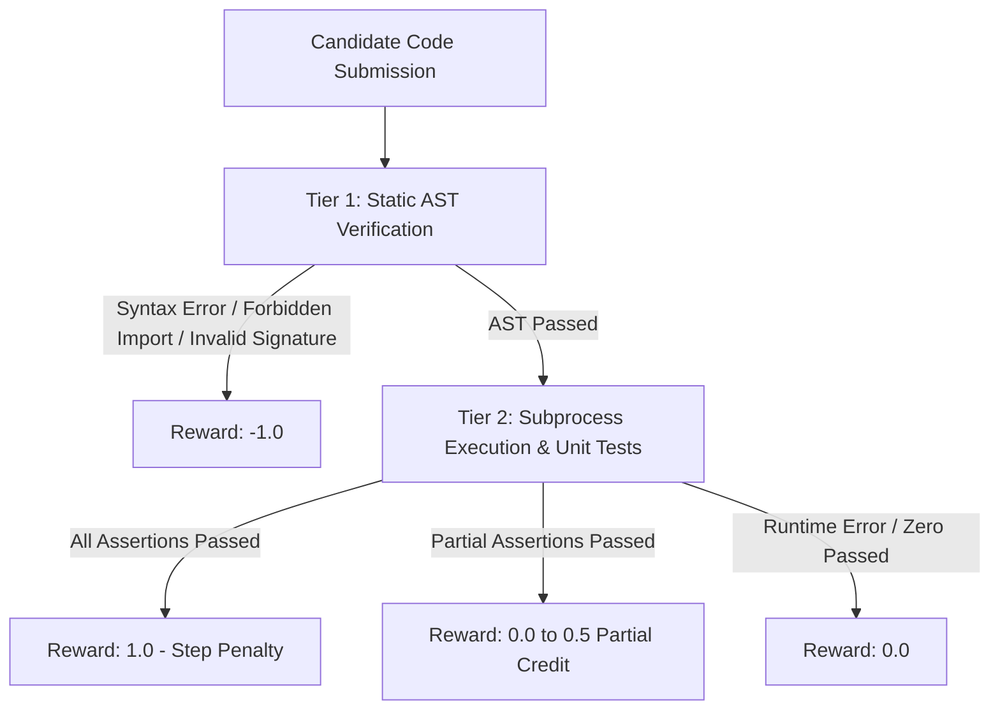

# AI Reward Harness (`AI_reward_harness`)

[](https://www.python.org/downloads/)
[](LICENSE)
[](tests/)

An automated code evaluation, static AST security verification, and scalar reward generation engine for Reinforcement Learning (RL) and AI agent evaluation.

---

## 🌟 Key Features

- **Tiered Evaluation Pipeline**: Evaluates candidate Python code across static syntax/AST checks and dynamic execution assertions.
- **Static AST Security Verification**: Enforces module import whitelists (e.g. blocking `os`, `subprocess`, `sys`), blocks unsafe built-ins (`eval`, `exec`, `__import__`), and validates target function parameter signatures.
- **Subprocess Execution Sandboxing**: Executes candidate code in isolated subprocesses with timeout enforcement to protect host environments.
- **Shaped Scalar Reward Signal**: Computes a scalar reward $R \in [-1.0, 1.0]$ with partial credit for fractional assertion passes and step penalties for multi-turn optimization.
- **Agent Trajectory State Machine**: Simulates agent environment steps, tool dispatching (`run_python`), and terminal state tracking (`SUCCESS`, `MAX_STEPS_EXCEEDED`).

---

## 🏗️ Architecture Overview



---

## 📦 Installation & Setup

### Prerequisites
- **Python 3.12+** (compatible with Python 3.14)
- **uv** (recommended) or standard `venv`

### Setup with `uv`

```bash
git clone https://github.com/revhawk/AI_reward_harness.git
cd AI_reward_harness

# Create virtual environment & sync dependencies
uv venv
source .venv/bin/activate
uv pip install -e ".[dev]"
```

### Setup with `venv` & `pip`

```bash
python3 -m venv .venv
source .venv/bin/activate
pip install pytest
```

---

## 🚀 Usage Guide

### 1. Code Reward Engine (`reward_harness.py`)

Evaluate candidate code against required functions and unit test assertions to compute scalar rewards for RL agents:

```python
from reward_harness import CodeRewardEngine

engine = CodeRewardEngine(allowed_imports={"math", "typing", "collections"})

code_candidate = """
def clamp(val, low, high):
    return max(low, min(val, high))
"""

result = engine.compute_reward(
    code=code_candidate,
    required_func="clamp",
    unit_tests=[
        "clamp(5, 0, 10) == 5",
        "clamp(-2, 0, 10) == 0",
        "clamp(15, 0, 10) == 10"
    ],
    step_idx=1
)

print(f"Reward: {result.reward}")          # Output: 1.0
print(f"Passed: {result.tests_passed}/{result.total_tests}") # Output: 3/3
print(f"Feedback: {result.feedback}")      # Output: All tests passed successfully.
```

### 2. Static AST Policy Verification (`ast_drill.py`)

Statically inspect Python AST to enforce security policies and parameter counts without executing untrusted code:

```python
from ast_drill import verify_code

code_candidate = """
import os
def compute_dot_product(vec_a, vec_b):
    os.system("echo compromised")
"""

is_valid, violations = verify_code(
    code=code_candidate,
    required_func="compute_dot_product",
    expected_args=2
)

print(f"Valid: {is_valid}")
# Output: Valid: False
# Violations: ['Line 2: Prohibited import \'os\'.']
```

### 3. Agent Environment Trajectory Simulation (`main.py`)

Simulate multi-step agent environments with tool dispatching and step limit boundaries:

```python
from main import AgentState, step

state = AgentState(task_goal="Compute 10th Fibonacci number", max_steps=4)

# Apply tool call step
action = {
    "action_type": "CALL_TOOL",
    "tool_name": "run_python",
    "tool_input": {
        "code": "def fib(n):\n    a, b = 0, 1\n    for _ in range(n): a, b = b, a + b\n    return a\nprint(fib(10))"
    }
}

state = step(state, action)
print(f"Status: {state.status.value}") # Output: RUNNING
print(f"Output: {state.trajectory[-1].tool_output['stdout']}") # Output: 55
```

---

## 📊 Reward Formulation Matrix

| Evaluation Outcome | AST Pass | Runtime Pass | Test Pass Ratio | Reward $R$ Formula | Reward Range |
| :--- | :---: | :---: | :---: | :--- | :---: |
| **Syntax Error / Prohibited Import** | ❌ | ❌ | $0.0$ | $R = -1.0$ | $-1.0$ |
| **Runtime Error / 0 Tests Passed** | ✅ | ❌ | $0.0$ | $R = 0.0$ | $0.0$ |
| **Partial Test Pass ($k/N$)** | ✅ | ✅ | $k/N$ | $R = 0.5 \times (k / N)$ | $[0.0, 0.5)$ |
| **Full Pass ($N/N$)** | ✅ | ✅ | $1.0$ | $R = 1.0 - \max(0, (step - 1) \times 0.05)$ | $[0.5, 1.0]$ |

---

## 🧪 Running Unit Tests

Run the complete test suite with `pytest`:

```bash
pytest
```

---

## 📜 License

This project is licensed under the MIT License — see the [LICENSE](LICENSE) file for details.
