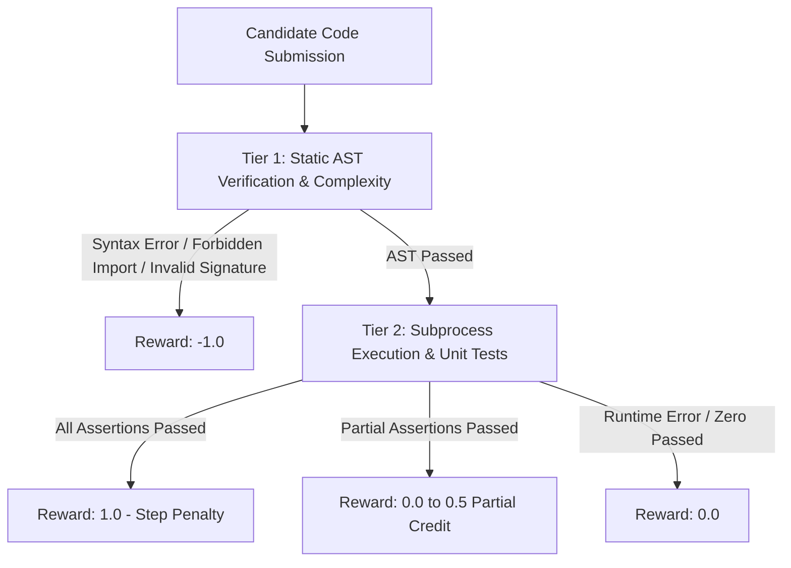

# AI Reward Harness (`AI_reward_harness`)

[](https://www.python.org/downloads/)
[](LICENSE)
[](tests/)

An automated code evaluation, static AST security verification, advanced execution metrics, and scalar reward generation engine for Reinforcement Learning (RL) and AI agent evaluation.

---

## 🌟 Key Features

- **Tiered Evaluation Pipeline**: Evaluates candidate Python code across static syntax/AST checks and dynamic execution assertions.
- **Static AST Security Verification**: Enforces module import whitelists (e.g. blocking `os`, `subprocess`, `sys`), blocks unsafe built-ins (`eval`, `exec`, `__import__`), and validates target function parameter signatures.
- **Advanced Code Metrics**: Measures Cyclomatic Complexity ($V(G)$), Lines of Code (LOC), execution wall-clock latency (`exec_time_ms`), and assertion pass rate (`pass_rate`).
- **Batch Evaluation Aggregator**: Computes benchmark-wide summary metrics (`pass@1`, `mean_reward`, `mean_exec_time_ms`, `mean_complexity`).
- **Subprocess Execution Sandboxing**: Executes candidate code in isolated subprocesses with timeout enforcement to protect host environments.
- **Shaped Scalar Reward Signal**: Computes a scalar reward $R \in [-1.0, 1.0]$ with partial credit for fractional assertion passes and step penalties for multi-turn optimization.
- **Agent Trajectory State Machine**: Simulates agent environment steps, tool dispatching (`run_python`), and terminal state tracking (`SUCCESS`, `MAX_STEPS_EXCEEDED`).

---

## 🏗️ Architecture Overview



---

## 📦 Installation & Setup

### Prerequisites
- **Python 3.12+** (compatible with Python 3.14)
- **uv** (recommended) or standard `venv`

### Setup with `uv`

```bash
git clone https://github.com/revhawk/AI_reward_harness.git
cd AI_reward_harness

# Create virtual environment & sync dependencies
uv venv
source .venv/bin/activate
uv pip install -e ".[dev]"
```

### Setup with `venv` & `pip`

```bash
python3 -m venv .venv
source .venv/bin/activate
pip install pytest
```

---

## 🚀 Usage Guide

### 1. Single Code Reward & Metrics Evaluation (`reward_harness.py`)

Evaluate candidate code against required functions and unit test assertions to compute scalar rewards and performance metrics:

```python
from reward_harness import CodeRewardEngine

engine = CodeRewardEngine(allowed_imports={"math", "typing", "collections"})

code_candidate = """
def clamp(val, low, high):
    return max(low, min(val, high))
"""

result = engine.compute_reward(
    code=code_candidate,
    required_func="clamp",
    unit_tests=[
        "clamp(5, 0, 10) == 5",
        "clamp(-2, 0, 10) == 0",
        "clamp(15, 0, 10) == 10"
    ],
    step_idx=1
)

print(f"Reward: {result.reward}")              # Output: 1.0
print(f"Pass Rate: {result.pass_rate * 100}%")  # Output: 100.0%
print(f"Complexity V(G): {result.complexity}") # Output: 1
print(f"LOC: {result.loc}")                    # Output: 2
print(f"Execution Latency: {result.exec_time_ms} ms")
```

### 2. Batch Evaluation & Benchmark Summary (`evaluate_batch`)

Evaluate multiple candidate solutions in batch and compute aggregate benchmark statistics:

```python
candidates = [
    "import os\ndef clamp(v, l, h): return v",                # Invalid import
    "def clamp(v, l, h):\n    return max(v, l)",               # Partial pass
    "def clamp(v, l, h):\n    return max(l, min(v, h))"        # Full pass
]

results, summary = engine.evaluate_batch(
    candidates=candidates,
    required_func="clamp",
    unit_tests=["clamp(5, 0, 10) == 5", "clamp(-2, 0, 10) == 0"]
)

print(f"Pass@1: {summary.pass_at_1 * 100}%")
print(f"Mean Reward: {summary.mean_reward}")
print(f"Mean Latency: {summary.mean_exec_time_ms} ms")
print(f"Mean Complexity: {summary.mean_complexity}")
```

### 3. Static AST Policy Verification (`ast_drill.py`)

Statically inspect Python AST to enforce security policies and parameter counts without executing untrusted code:

```python
from ast_drill import verify_code

code_candidate = """
import os
def compute_dot_product(vec_a, vec_b):
    os.system("echo compromised")
"""

is_valid, violations = verify_code(
    code=code_candidate,
    required_func="compute_dot_product",
    expected_args=2
)

print(f"Valid: {is_valid}")
# Output: Valid: False
# Violations: ['Line 2: Prohibited import \'os\'.']
```

---

## 📊 Evaluation Metrics Reference

| Metric Name | Type | Description | Source |
| :--- | :--- | :--- | :--- |
| `reward` | `float` | Shaped scalar reward $R \in [-1.0, 1.0]$ | `reward_harness.py` |
| `pass_rate` | `float` | Ratio of unit tests passed ($0.0 \rightarrow 1.0$) | `reward_harness.py` |
| `complexity` | `int` | Cyclomatic Complexity $V(G)$ | AST static analysis |
| `loc` | `int` | Lines of non-empty, non-comment code | Static line analysis |
| `exec_time_ms` | `float` | Execution wall-clock time in milliseconds | Subprocess timing |
| `pass_at_1` | `float` | Batch success rate on first attempt | `evaluate_batch()` |
| `mean_reward` | `float` | Average scalar reward across batch | `evaluate_batch()` |

---

## 🧪 Running Unit Tests

Run the complete test suite with `pytest`:

```bash
pytest
```

---

## 📜 License

This project is licensed under the MIT License — see the [LICENSE](LICENSE) file for details.
